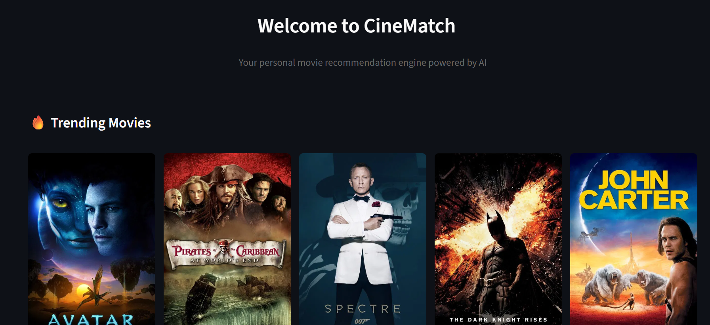
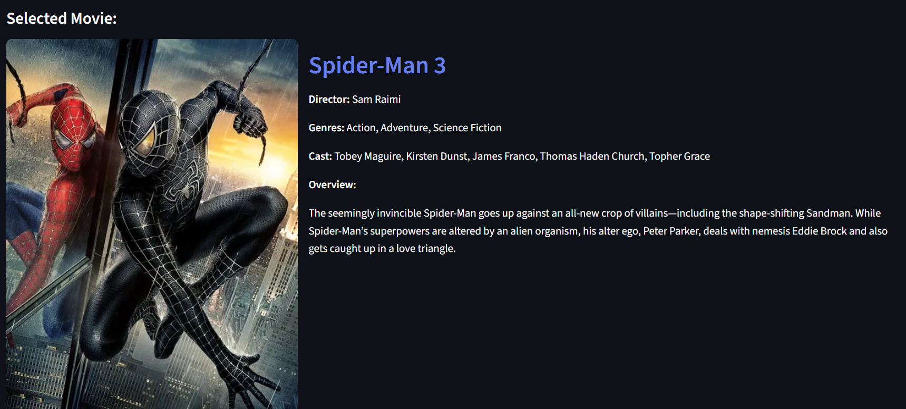

# 🎬 CineMatch - Movie Recommender System

A beautiful and intelligent movie recommendation system built with Streamlit and Machine Learning.

## Features

- 🎯 **Smart Recommendations** - Get 10 similar movie suggestions based on content-based filtering
- 🔍 **Advanced Search** - Search through thousands of movies
- 🎨 **Beautiful UI** - Modern, responsive design with smooth animations
- 📱 **Multi-Page Layout** - Organized navigation with Home, Search, and About pages
- 🖼️ **Movie Posters** - Fetches real movie posters from TMDB API

## Screenshots






## Installation

1. **Clone the repository**
```bash
git clone https://github.com/yourusername/movie-recommender-system.git
cd movie-recommender-system
```

2. **Install dependencies**
```bash
pip install -r requirements.txt
```

3. **Set up TMDB API Key**
   - Get your free API key from [TMDB](https://www.themoviedb.org/settings/api)
   - Copy `.env.example` to `.env`
   - Add your API key to `.env`:
   ```
   TMDB_API_KEY=your_api_key_here
   ```

4. **Run the application**
```bash
streamlit run app.py
```

## Project Structure

```
Movie_Recommender_system/
├── app.py                          # Main application file
├── movies_dict.pkl                 # Processed movie data
├── similarity.pkl                  # Similarity matrix
├── .env                           # Environment variables (not in git)
├── .env.example                   # Template for environment variables
├── requirements.txt               # Python dependencies
├── .gitignore                     # Git ignore file
└── README.md                      # This file
```

## How It Works

1. **Data Processing** - Movie data is preprocessed using NLP techniques (stemming, vectorization)
2. **Similarity Calculation** - Cosine similarity is computed between movie feature vectors
3. **Recommendation** - When you select a movie, the system finds the 10 most similar movies
4. **Display** - Results are shown with movie posters fetched from TMDB API

## Technologies Used

- **Streamlit** - Web framework
- **Pandas** - Data manipulation
- **Scikit-learn** - Machine learning (CountVectorizer, Cosine Similarity)
- **NLTK** - Natural language processing
- **TMDB API** - Movie posters and metadata
- **Python-dotenv** - Environment variable management

## Dataset

The project uses the TMDB 5000 Movie Dataset containing:
- Movie titles
- Genres
- Keywords
- Cast
- Crew
- Overview

## Contributing

Contributions are welcome! Please feel free to submit a Pull Request.

## License

This project is licensed under the MIT License.

## Acknowledgments

- TMDB for providing the movie API
- TMDB 5000 Movie Dataset
- Streamlit for the amazing framework

## Contact

Your Name - [@yourtwitter](https://twitter.com/yourtwitter)

Project Link: [https://github.com/yourusername/movie-recommender-system](https://github.com/yourusername/movie-recommender-system)
